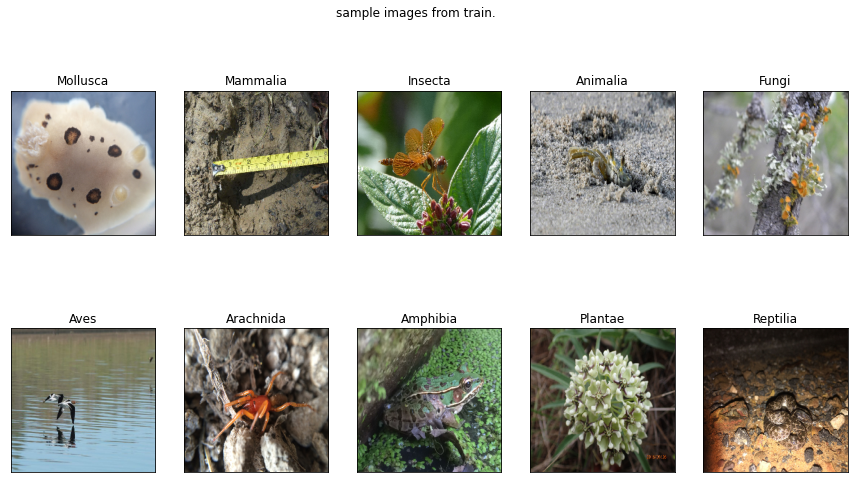

# cs6910_Assignment2
0.Dataset link : https://www.kaggle.com/aryanpandey1109/inaturalist12k  or  https://storage.googleapis.com/wandb_datasets/nature_12K.zip

1.The dataset contains 10 classes where each class has 1k images of that category.

2.This project can be divided into 3 parts:
2.1.Implementation of different Convolutional Neural Network architectures on the Dataset

2.2.FineTuning the pre existing models like Resnet , InceptionV2 , Xception on the dataset.

2.3.Visualization of a CNN.

3PartA contains the ipynb file of PartA.
The 'TestpartA.ipynb' is given inside the folder to check the correctness of the code.kindly run the fixed number of cells to check the correctness of code.(3mins max)

4.'TestpartA.ipynb' is without any wandb run.you can change the parameters there.

5.partB contains the ipynb file of partB.

6.'TestpartB.ipynb' is given to check the correctness of code. just run each cell starting from first.it will not take more than 3 mins to check the code.
